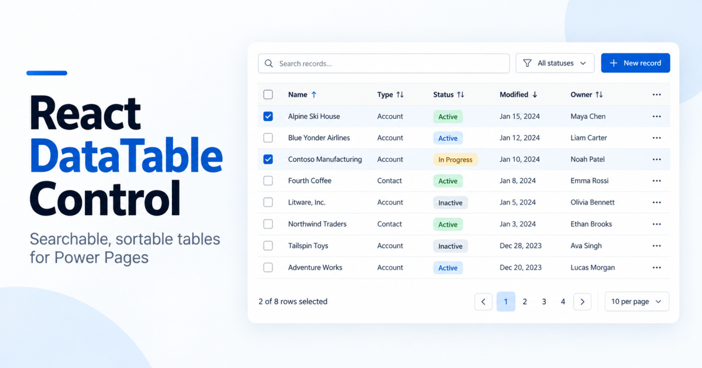

# react-datatable-control

A React 18 and Fluent UI v9 data table for Microsoft Power Pages. It renders the rows of a Dataverse entity view as a searchable, sortable, paged table, with row selection, row actions, toolbar buttons, status badges and CSV/Excel export. It ships as one script file and one stylesheet, with no runtime dependency on the page.

**Status:** v0.1 (draft)

---

## Why this control

Power Pages sites usually show lists with entity lists or DataTables. This control is meant for portals that:

- already use the Fluent design language and want a table that looks native there;
- need per-row actions and bulk toolbar actions that react to the row's data (for example, only show "Approve" for rows in a given state);
- need to avoid a jQuery/Bootstrap-specific table plugin;
- want a small configuration file instead of per-column JavaScript.

## Features

- Client-side sorting (single column), global search, paging with page-size options, row numbers.
- Row selection with checkboxes, including select-all across all pages of the current filter.
- Per-row "..." action menu (with sub-menus and dividers) and toolbar buttons enabled by the selection. Both can be shown or hidden per row from a row's column value.
- Cell renderers chosen by configuration: text, number, money, date, date-time, choice badge (colour and tooltip), tags, link, actions.
- Locale-aware date, number and money formatting. Date-only values are never shifted by time zone.
- Export of the filtered (or selected) rows to CSV and Excel (`.xlsx`), without extra libraries.
- An external filter API for drop-downs outside the table.
- DOM events and a small JavaScript API for page scripts.
- Overridable UI labels for localisation.
- No `innerHTML` in the control's own code. Links are checked against `javascript:` and cross-origin URLs.

## Not included (yet)

Server-side paging, virtual scrolling, column resize/reorder/visibility menus, per-column filter menus, multi-column sort, row grouping and saved state. The table loads all rows of a view at once, so it fits views of up to a few thousand rows (Dataverse and Power Pages cap a view page at 5,000 records).

## Requirements

- Current evergreen browsers (Edge, Chrome, Safari, Firefox).
- Node.js 20 LTS or later and npm to build.
- A Power Pages site where you can upload web files and edit web templates.

---

## Quick start

```bash
npm install

# local demo with sample data (http://localhost:5173)
npm run dev

# type-check, build the bundle, check its size budget
npm run build

# unit and component tests
npm test
```

The build writes `dist/aidevme-data-table.min.js` and `dist/aidevme-data-table.min.css`. Upload both as web files on your site and load them in the page template:

```html
<link rel="stylesheet" href="/styles/aidevme-data-table.min.css" />
<script src="/scripts/hso-data-table-config.js" defer></script>  <!-- optional config, load before the bundle -->
<script src="/scripts/aidevme-data-table.min.js" defer></script>
```

Dataverse blocks `.js` attachments on web files. Upload the script as a file without an extension (MIME `application/octet-stream`) and give the web file a Partial URL that ends in `.js`.

---

## How it works

1. Your Liquid web template writes the rows of an entity view as JSON inside a `<script type="application/json">` element, next to an empty mount element.
2. When the page loads, the bundle finds every element with `data-hso-grid`, reads its JSON, and mounts a table into it.
3. Each cell is resolved once (display text, sort key, filter text) and the table sorts, filters and pages in the browser.

### Markup

```html
<div id="hso-grid-Orders" data-hso-grid>
  <div class="hso-dt-preload" role="status">Loading…</div>
</div>

<script type="application/json" data-hso-grid-data="Orders">
{ ... see the data contract below ... }
</script>
```

The id after `hso-grid-` and the value of `data-hso-grid-data` must match. Use a different id for every grid on a page. For grids added later, call `HsoDataTable.mountAll(scope)`.

### Data contract

```json
{
  "logicalName": "new_order",
  "viewName": "Open orders",
  "exists": true,
  "totalRecords": 2,
  "columns": [
    { "logicalName": "new_name", "name": "Order", "attributeType": "String" },
    { "logicalName": "new_status", "name": "Status", "attributeType": "Picklist" }
  ],
  "rows": [
    {
      "id": "00000000-0000-0000-0000-000000000001",
      "values": {
        "new_name": "ORD-1",
        "new_status": { "Label": "Open", "Value": 100000000 }
      },
      "formatted": { "new_name": null, "new_status": "Open" }
    }
  ]
}
```

- Cell values are `null`, a string, `{ "Label", "Value" }` for choices, or `{ "Name", "Id" }` for lookups.
- Dates are `yyyy-MM-dd HH:mm:ss` strings. Numbers and money are numeric strings.
- If the view cannot be read, emit `{ "error": "message" }` and the control shows an error state.
- Build the JSON by hand in Liquid: the `json` filter does not quote strings on every Power Pages site, and values must be escaped (backslash, double quote and `</`).
- Security is enforced by Dataverse table permissions on the server. The control only displays what the page gives it.

---

## Configuration

Configuration is optional. Without it, headers and types come from the view's own metadata. To change presentation, set `window.HsoDataTableConfig` before the bundle loads. Keys are `<entity logical name>|<view name>` and must match the JSON's `logicalName` and `viewName`.

```javascript
window.HsoDataTableConfig = {
  'new_order|Open orders': {
    title: 'Open orders',
    selectable: true,
    columns: {
      new_name: { header: 'Order', type: 'link', href: '/order-details/?id={id}' },
      new_status: {
        type: 'choice',
        options: {
          100000000: { label: 'Open', color: '#F59E0B', description: 'Waiting for a decision' },
          100000001: { label: 'Approved', color: '#22C55E', description: 'Approved' }
        }
      }
    },
    rowActions: [
      { id: 'view', label: 'View' },
      { id: 'approve', label: 'Approve', hiddenWhen: { column: 'new_status', in: [100000001] } },
      { divider: true, id: 'd1' },
      { id: 'reject', label: 'Reject', hiddenWhen: { column: 'new_status', in: [100000001] } }
    ],
    toolbarButtons: [
      { id: 'approve', label: 'Approve', hiddenWhen: { column: 'new_status', in: [100000001] } }
    ],
    actionsAfterColumn: 'new_name'
  }
};
```

| Key | Meaning |
|---|---|
| `title` | Heading above the table. An empty string hides it. |
| `selectable` | Show the checkbox column (default `true`). |
| `columns[key]` | Per-column overrides: `header`, `headerTooltip`, `type`, `width`, `minWidth`, `sortable`, `searchable`, `hidden`, `options`, `href`. |
| `rowActions` | Items of the row "..." menu. Items can have `children` (sub-menu) or be `{ divider: true }`. |
| `toolbarButtons` | Buttons above the table, enabled by the selection. `singleRow: true` means exactly one selected row. |
| `visibleWhen` / `hiddenWhen` | On a row action or toolbar button: `{ column, in: [values] }` shows or hides it for a row. For a toolbar button it is disabled unless every selected row allows it. |
| `actionsAfterColumn` | Column after which the actions column is placed. |

Column types: `text`, `number`, `money`, `date`, `datetime`, `choice`, `tags`, `link`, `actions`.

### Options on the mount element

| Attribute | Effect |
|---|---|
| `data-toolbar-buttons="false"` | Hides `toolbarButtons` and their dividers. Export, search, paging and the row menu stay. Default `true`. |

Other options (search box, export, selection, rows per page, default sort and so on) are read from `data-*` attributes or passed to `mount()`. The full list is in `src/types.ts`.

---

## JavaScript API

```javascript
const grid = HsoDataTable.get('Orders');   // a mounted grid, by id
HsoDataTable.mount(el, payload);            // mount manually
HsoDataTable.mountAll(scope);               // mount grids added later

grid.setPayload(data);       // replace the data (or { error: '...' })
grid.setLoading(true);       // show the loading state
grid.refresh();              // re-measure, for example after a tab becomes visible
grid.setFilter('new_status', 100000000); // external filter; pass null to clear
grid.clearFilters();
grid.getState();             // { sort, search, page, rowsPerPage }
grid.getSelection();         // selected row ids
grid.clearSelection();
grid.destroy();
```

## Events

Events bubble from the grid element:

| Event | `detail` |
|---|---|
| `hso-data-table:action` | `{ id, actionId, rowId, rowIds }` for a row action or toolbar button |
| `hso-data-table:ready` | `{ total }` |
| `hso-data-table:rowcount` | `{ total, filtered }` |
| `hso-data-table:statechange` | `{ sort, search, page, rowsPerPage }` |
| `hso-data-table:selectionchange` | the selected ids (see `src/types.ts`) |
| `hso-data-table:export` | export details (see `src/types.ts`) |

```javascript
document.addEventListener('hso-data-table:action', (e) => {
  if (e.detail.actionId === 'approve') {
    // open a dialog or call the Web API for e.detail.rowId
  }
});
```

Writes (Web API calls, dialogs, redirects) belong in your page script. The control does not call Dataverse.

## Localisation

UI text comes from `src/i18n/labels.ts`. Override any label with `window.HsoDataTableLabels` before the bundle loads, for example with values read from Power Pages content snippets. Dates and numbers follow the browser or `window.HsoDataTableLocale`.

---

## Project layout

```
src/
  index.ts            auto-mount and public API
  HsoDataTable.tsx    root component (toolbar, table, footer)
  types.ts            options, column and action types
  core/               pure data pipeline (parse, resolve cells, sort/filter/page, format, export)
  components/         toolbar, header cell, cell renderers, footer, empty/loading/error states
  i18n/labels.ts      default UI text
test/                 Vitest unit and component tests
demo/                 local demo (npm run dev)
scripts/              bundle size check
```

The core pipeline has no React dependency and is covered by unit tests.

## Development

- Fluent UI (`@fluentui/react-components`) and React are pinned. Update them only after re-testing sorting and column sizing.
- Run `npm test` before every commit. Do not add `innerHTML` or `dangerouslySetInnerHTML`.
- The build fails if the gzipped bundle exceeds the budget in `scripts/check-size.mjs`.

## Known limits and roadmap

All rows of a view are loaded with the page (up to 5,000 per view). Planned work: measured performance at 5,000 rows, automated accessibility tests, per-column filters, column visibility, server-side paging and virtual scrolling.

## License

Add a license before publishing (for example MIT).
